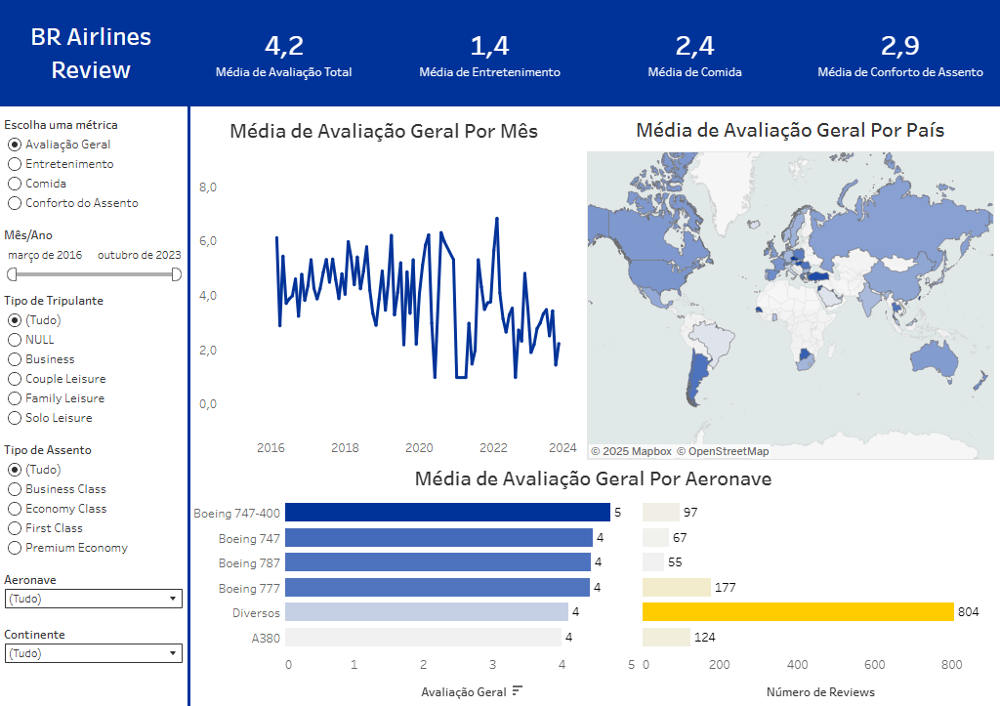

# 📊 Dashboard: BR Airlines Review ✈️

Este projeto foi desenvolvido com Tableau como parte do meu portfólio na área de Análise de Dados. A proposta central foi analisar a satisfação dos passageiros com o **entretenimento a bordo** da companhia fictícia **BR Airlines**. 

A partir desse foco, a análise foi expandida para outros aspectos relevantes da experiência de voo, como **comida e bebidas**, **conforto do assento** e a **avaliação geral** dos passageiros, segmentando os dados por mês, país, tipo de assento, tipo de viajante e modelo de aeronave.

---

## 🔍 Sobre os dados

- Os dados utilizados são públicos e foram disponibilizados pelo criador de conteúdo **Mo Chen** no YouTube, voltados a projetos práticos de Data Analytics.
- A **BR Airlines** é uma empresa fictícia, criada apenas para fins educacionais e de simulação de negócio.
- A base de dados contém milhares de avaliações reais de passageiros, categorizadas por diversos aspectos da experiência a bordo.

---

## 🛠️ Ferramentas utilizadas

- **Tableau** – Para visualização e storytelling com dados
- **CSV (dados estruturados)** – Para análise e conexão com o Tableau
- **GitHub** – Para versionamento e divulgação do projeto

---

## 🖼️ Prévia do dashboard

---

## 🔗 Versão interativa no Tableau Public

👉 Acesse aqui: https://public.tableau.com/views/BR_Airlines/Dashboard1?:language=en-US&:sid=&:redirect=auth&:display_count=n&:origin=viz_share_link

---

## 📁 Arquivos disponíveis neste repositório

- `BR-Airlines.twbx` – Arquivo do Tableau (pacote completo)
- `ba_reviews.csv` – Arquivo de dados original usado na análise
- `countries.csv` – Arquivo de dados original usado na análise
- `BR-Airlines-Dashboard.png` – Imagem do dashboard final
- `README.md` – Descrição e documentação do projeto

---

## ✨ Objetivos principais do projeto

- Praticar a construção de dashboards profissionais com Tableau
- Aplicar conceitos de análise exploratória e visualização de dados
- Comunicar insights relevantes sobre a experiência do cliente no setor aéreo
- Compartilhar o projeto em plataformas públicas como parte do portfólio

---

## 💬 Fale comigo

Se quiser conversar sobre o projeto, tirar dúvidas ou propor melhorias, estou à disposição!

📧 monjaedu027@gmail.com

[🔗 Meu LinkedIn](https://www.linkedin.com/in/julia-monjardim-de-carvalho/)

---
